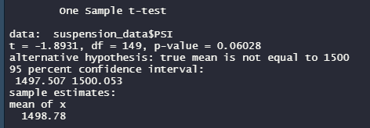

# mechacar-statistical-analysis
Data Analysis Bootcamp - Week 15

## Overview
The purpose of this repository is to calculate statistics for AutosRUs and their new prototype, the MechaCar. We'll use the R script [MechaCarChallenge](MechaCarChallenge.R) to calculate these statistics and then put analyses of the results in to this readme file.

## Resources
- [MPG Data](data/MechaCar_mpg.csv)
- [Suspension Coil Data](data/Suspension_Coil.csv)

## Linear Regression to Predict MPG

### Which variables/coefficients provided a non-random amount of variance to the mpg values in the dataset?
The two variables that pass the standard 5% confidence level cutoff are vehicle length and ground clearance. While there is some influence from vehicle weight there isn't enough data to say with confidence that it has a statistically significant effect on MPG.

### Is the slope of the linear model considered to be zero? Why or why not?
Our overall regression p-value is incredibly small (5.35E-11), meaning that we have enough data to reject the null hypothesis and we accept the alternative hypothesis that the slope of the linear model is non-zero.

### Does this linear model predict mpg of MechaCar prototypes effectively? Why or why not?
This model has an R-squared value of 71.5%, meaning that it does a decent job at predicting MPG. We would like to see that number be higher for more comfort, but as it stands, the current model will predict a future answer accurately around 70% of the time.

## Summary Statistics on Suspension Coils

### The design specifications for the MechaCar suspension coils dictate that the variance of the suspension coils must not exceed 100 pounds per square inch. Does the current manufacturing data meet this design specification for all manufacturing lots in total and each lot individually? Why or why not?
In total, yes, the suspension coils fall below the 100 pounds per square inch variance threshhold, with a variance of 62.3. 

However, when looking at individual manufacturing lots, it seems like Lot 1 and Lot 2 have much more consistency, with variances of 1 and 7, respectively and most of the variance in the total manufacturing group is coming from Lot 3, which has a variance of 170 PSI. Lot 3 does not meet the design specifications. 

## T-Tests on Suspension Coils
For all of these tests we'll have the same H0 and Ha. 
H0: there is no statistical difference between the sample mean and the population mean (assumed to be 1,500) 
Ha: there is a statistical difference between the sample mean and the population mean (assumed to be 1,500)

### Total Manufactured Group
 
Here we have a p-value of 0.06. Assuming we're working with a confidence level of 0.05, then we will opt to fail to reject H0 and say that the means between the total group and the population are statistically similar.

### Lot 1
 
Here we have a p-value of 1. Assuming we're working with a confidence level of 0.05, then we will opt to fail to reject H0 and say that the means between the total group and the population are statistically similar.

### Lot 2
 
Here we have a p-value of 0.6072. Assuming we're working with a confidence level of 0.05, then we will opt to fail to reject H0 and say that the means between the total group and the population are statistically similar.

### Lot 3
 
Here we have a p-value of 0.04. Assuming we're working with a confidence level of 0.05, then we will opt to reject H0 and say that the means between the total group and the population are not statistically similar. This is in line with our intuition already, when we looked at the summary statistics for suspension coils Lot 3 stood out there as well.

## Study Design: MechaCar vs Competition

### Write a short description of a statistical study that can quantify how the MechaCar performs against the competition.
A test that could be done is seeing if there is a difference in the combined fuel efficiency between MechaCar and its competitors in each vehicle class it produces.

- What metric or metrics are you going to test?

City and highway fuel efficiency, grouped together into a combined fuel efficiency. From the [EPA]("https://www.epa.gov/fueleconomy/text-version-gasoline-label): "Combined fuel economy is a weighted average of City and Highway MPG values that is calculated by weighting the City value by 55% and the Highway value by 45%."

We can use that weighting to calculate the combined fuel efficiency for each vehicle. This is helpful since it narrows down the two mpgs to one number to compare and becuase most people do a mix of highway and city driving, so using either of those illustrates an extreme that may not be representative of normal driving.

- What is the null hypothesis or alternative hypothesis?

H0: there is no statistical difference between the two sample means 
Ha: there is a statistical difference between the two sample means

- What statistical test would you use to test the hypothesis? And why?

As described, a two-sample T-Test would be used. This would be looking at MechaCar vs one competitor at a time.

- What data is needed to run the statistical test?

City and Highway fuel efficiency, from which we'll calculate a combined Fuel Efficienct. Additionally, we'll need the class of the vehicle as a categorical variable, to compare sedans to sedans, hybrids to hybrids, trucks to trucks, etc... We'll run the test for each category in a way similar to when we ran one-sample t-tests for each production lot earlier in this challenge.